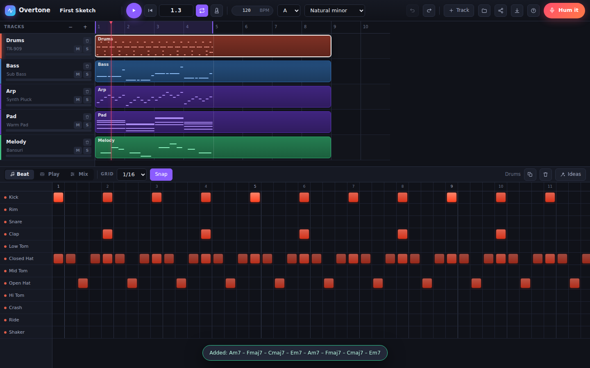
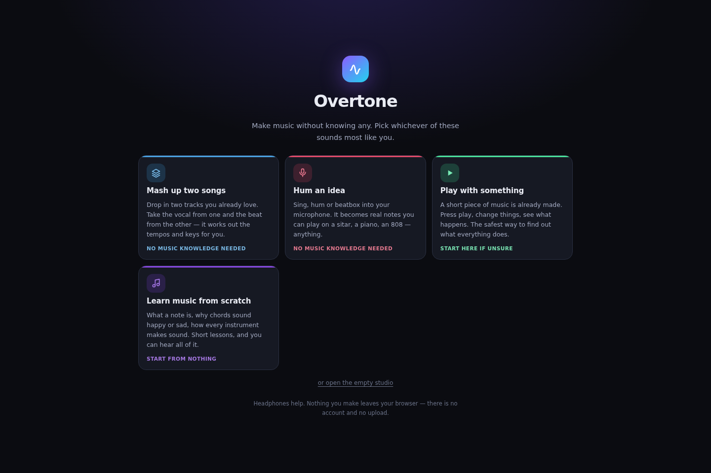
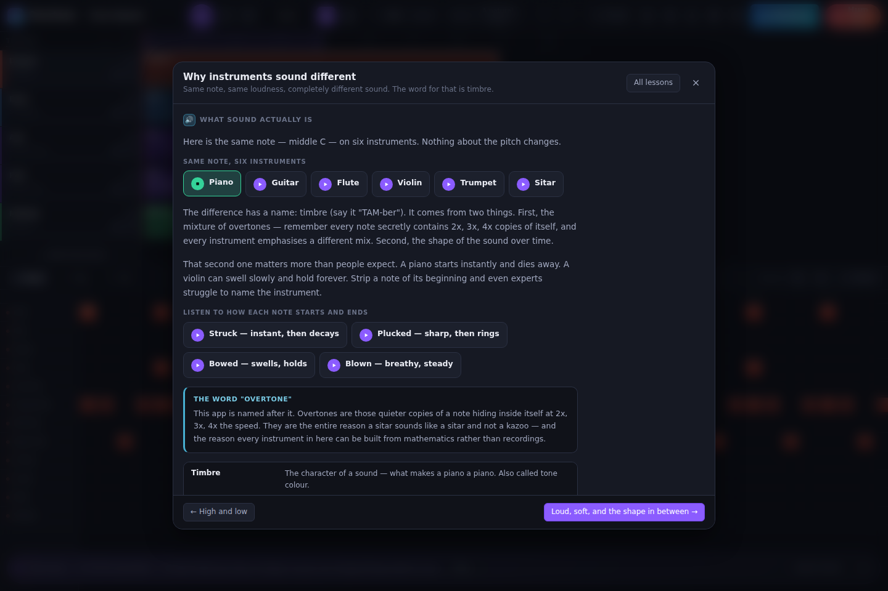
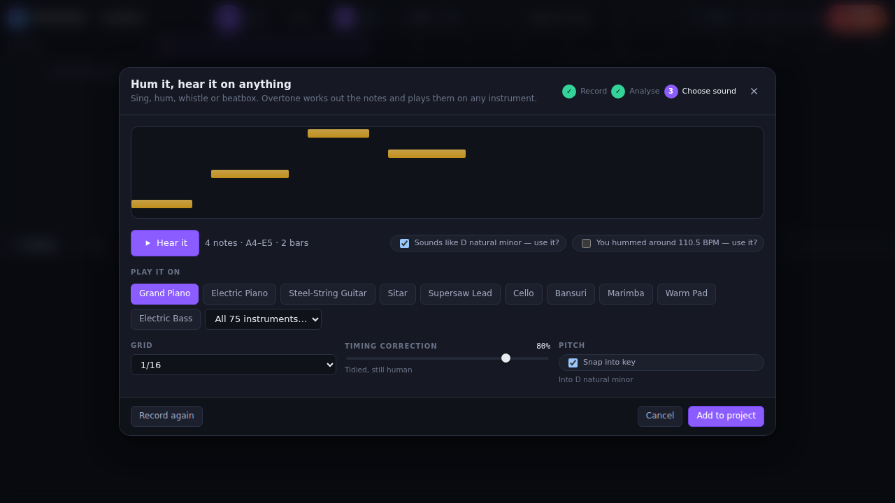
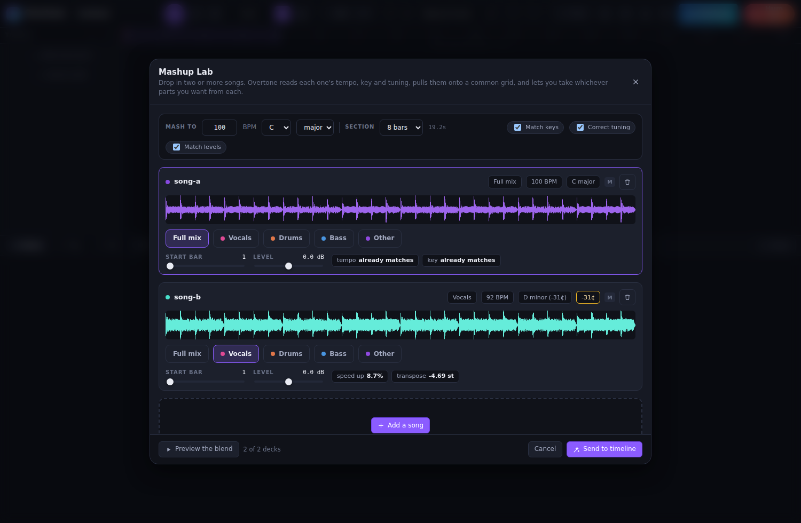

# Overtone

**Hum it, hear it on anything. Then build the whole track around it.**

A digital audio workstation that runs entirely in your browser. Sing, hum,
beatbox or play chords into it and they come back as notes on any instrument
you like. Drop in finished songs and it works out their tempo, key and tuning,
separates them into stems, and mashes them together on one grid.

It also teaches you music, if you don't know any. Eight modules from what
sound physically is through to mixing, and every example can be played.

No install, no account, no upload. Everything runs locally and stays there.

```bash
npm install
npm run dev        # http://localhost:5173
```



---

## What it does

### Start without knowing anything



Four doors, phrased as things you might want to do rather than DAW features.
Two of them need no music knowledge at all. New users land in a simplified
view that hides the key and scale controls and suggests a next step based on
what the project actually contains; one click leaves it for good.

**Learn music** is a full course built into the app: ten modules, 42 lessons,
covering what sound is, notes and intervals, scales (including ragas, maqam and
modes), chords and progressions, rhythm and groove, every instrument family and
how it physically makes sound, the instruments and cross-rhythms of West
Africa, the Middle East, India, East Asia and Latin America, then arrangement,
mixing, and how dance music is actually produced — the grid, the sidechain
pump, builds and drops, and where the familiar synth sounds come from.



Every concept is paired with something you can play. That is the reason it
lives in the app rather than in a document — you cannot read what a bowed
string sounds like, or hear that a major chord is sitting inside the harmonic
series. Demos run on hidden tracks, so opening a lesson mid-arrangement
disturbs nothing.

Jargon explains itself where it appears: hover any underlined label for a
plain-English meaning and a link to the lesson that covers it properly.

### Capture an idea

**Hum → notes → any instrument.** Record from the mic, and a YIN pitch tracker
turns the take into notes: onsets, pitches, velocities and a tempo estimate. It
reads the key you hummed in, so "snap into key" corrects your pitching instead
of transposing your idea somewhere else. Then you pick the sound — and swapping
instruments re-voices the same performance instantly, which is the whole point.

**Beatbox a rhythm.** Onsets are classified by frequency band into kick, snare
and hat, and land on a drum kit.

**Play chords.** Strum a guitar or play a piano into the mic and it reads the
progression — chroma matched against triad templates, weighted by the bass
note, which is what separates A minor from F major when they share two of
three notes.



### Work with recorded audio

**Import anything.** Drop in an MP3, WAV, M4A or FLAC and it's analysed for
tempo, beat grid, downbeat, key, chords and tuning reference. Clips warp to the
project tempo with a phase vocoder (or repitch, if you want the turntable
effect), transpose to the project key, and trim, fade and reverse like any DAW.

**Record real instruments.** Arm a track and play — the take lands on the
timeline at the beat it started on.

**Separate stems.** Any clip splits into vocals, drums, bass and other, each on
its own track.

### Mash things up

Drop two or more songs into the **Mashup Lab**. Each is analysed and pulled onto
a shared grid — the first song sets the target, everything else follows. Pick
which stems come from which song, preview the blend as a loop, then send it to
the timeline, where each part is baked at the target tempo.



The cross-language part isn't a feature so much as a consequence: separation and
matching work on the spectrogram and the beat grid, never on words, so a Tamil
vocal behaves exactly like an English one. Where it *does* show up is **tuning**.
Plenty of recordings — older film music, a lot of Indian and Arabic repertoire,
anything cut to tape — sit tens of cents off A440. Overtone measures each track's
actual tuning reference and folds the correction into the transposition, so a
song cut 30 cents flat lands in tune rather than between two semitones.

### Build the track

Arrangement timeline with draggable audio and MIDI clips, a piano roll, a drum
step grid, a mixer with per-channel sends, drive, tone and a tempo-synced
sidechain **pump** (the duck that makes dance records breathe — scheduled off
the grid rather than triggered by the kick, so it lands whatever the drums are
playing, and it is in the bounce as well as the monitor), a playable keyboard
that records into a clip, and undo/redo throughout.


**157 instruments, none of them sampled.** Every instrument is synthesised from
scratch, which is why the app is ~185 KB gzipped and works offline. 134 melodic
instruments and 23 drum kits: keys, guitars, bowed strings, winds, brass,
mallets, synths, bass, voices, and a deliberate spread of world instruments
(sitar with a real jawari bridge buzz, kora, guzheng, pipa, duduk, balafon,
mbira, oud, bansuri, shakuhachi, kalimba, santoor, erhu, gamelan).

The dance-music end is covered properly too: supersaws, hoovers, house stabs,
trance plucks, gated pads and vocal chops; wobble, Reese, neuro, donk and 808
basses; a transitions kit of risers, downlifters, impacts, sweeps and snare
rolls written in **bars** rather than seconds, so they still land on the
downbeat when you change the tempo; and kits for techno, breakbeat, disco,
amapiano, afrobeats, afro house, West African drums, darbuka, dhol, samba,
taiko and reggaeton.

**Ideas.** Chord progressions fitted bar-by-bar to what you've written, bass
lines that follow the harmony, drum patterns in twelve styles (house, boom bap,
trap, rock, teental, latin, amapiano, afrobeats, afro house, techno, breakbeat
and reggaeton), harmony lines that stay in key. All local, all from music theory, all undoable.

**Getting work out.** A WAV rendered offline through the exact signal chain you
hear; every track bounced as its own stem; MIDI for another DAW; a project
bundle with the audio inside it; or a share link with the whole arrangement in
the URL.

## How it's put together

```
src/
  audio/
    engine.ts            transport, scheduler, channel strips, master bus
    dsp.ts               noise, saturation, reverb impulses, envelopes
    recorder.ts          raw PCM mic capture
    instruments/
      subtractive.ts     oscillators → filter → amp  (pads, leads, winds, bowed)
      fm.ts              routable operators          (EPs, bells, mallets, brass)
      pluck.ts           extended Karplus-Strong     (guitars, sitar, harp, piano)
      drums.ts           procedural percussion, incl. log drums and build FX
      preset-kit.ts      the builders every preset file shares
      presets.ts         the instrument library, and what it all adds up to
      presets-electronic.ts  EDM synths, basses, and the transitions kit
      presets-african.ts     kora, ngoni, balafon, mbira, and the Afro kits
      presets-world.ts       Asia, the Middle East, Latin America
      presets-orchestral.ts  the rest of the orchestra, and vintage keys
    pump.ts              sidechain duck envelopes (pure, so it is tested)
    spectral/
      fft.ts             radix-2 FFT, windows, cached plans
      stft.ts            streaming frame iterator + block STFT/ISTFT
      vocoder.ts         phase vocoder: time-stretch, pitch-shift, warp
      stems.ts           harmonic/percussive + centre extraction → 4 stems
    analysis/
      pitch.ts           YIN, segmentation, onsets, tempo — pure functions
      audio.ts           tempo, beat grid, key, tuning, chords for recordings
      analysis.worker.ts pitch analysis off the main thread
    workers/dsp.worker.ts  analysis, separation and warping off the main thread
  music/
    theory.ts            scales (incl. ragas and maqam), chords, progressions
    key.ts               key detection from a melody
    matching.ts          tempo/key/tuning matching between recordings
    quantize.ts          analysis → notes, with a quantise *strength*
    project.ts           the data model, and the scheduler's view of it
    demo.ts              the starter groove
  lib/
    samples.ts           IndexedDB audio store + warp cache
    mashup.ts            deck model, slicing, match planning
    bundle.ts            single-file project + audio container
    export.ts            offline render, stems, MIDI
  learn/
    types.ts             lesson data model — pure data, no audio
    curriculum.ts        the eight modules, assembled
    modules/             lesson content
    player.ts            plays demos on hidden tracks
    glossary.ts          plain-language meanings, merged with lesson terms
  ai/                    provider seam + the local theory-based provider
  state/store.ts         zustand store; engine reconciliation
  ui/                    React components
public/worklets/         audio worklets (plain JS, loaded at runtime)
```

### Decisions worth knowing about

**Time is beats, everywhere.** Seconds only appear at the audio layer, so a
tempo change never rewrites musical data.

**The playhead is not in React state.** It moves 60 times a second; pushing it
through the store would re-render the app on every frame. `usePlayhead` reads
it straight from the engine instead.

**Scheduling uses two clocks.** A worker-driven timer wakes the scheduler every
25 ms and it schedules everything in the next 140 ms against the AudioContext
clock — the only clock accurate enough. The worker matters: a plain
`setInterval` gets throttled hard in a background tab and playback stutters.

**Karplus-Strong lives in an AudioWorklet.** A native `DelayNode` feedback loop
has a one-render-quantum (128 sample) minimum delay, which caps the pitch at
about 344 Hz — useless for a guitar. The worklet uses a plain circular buffer
with a fractional read, so any pitch works, plus an allpass stage for string
stiffness and a nonlinear bridge stage for the sitar's buzz.

**Offline rendering can't use `postMessage`.** Messages posted in the same task
as `startRendering()` are never delivered, so plucked instruments rendered
silent. Offline instruments buffer their schedule and hand it to the processor
through `processorOptions` at construction, committed by `finalize()`. This was
found by a browser test, not by reading the spec.

**Quantisation is a strength, not a switch.** Pulling a hummed take fully onto
a 16th grid makes it stiff. The default of 80% fixes the sloppiness and keeps
the feel.

**Suggestions are pure functions over the project.** A suggestion returns a new
project rather than mutating one, which keeps undo working and means a future
remote provider's output can be inspected before it's applied — never executed.

**Audio clip length is derived, not stored.** A warped clip's timeline length
depends on the project tempo, so it's computed from the source duration and the
warp speed. Change the tempo and every warped clip re-fits itself; nothing goes
stale.

**Tuning is measured, not assumed.** Chroma built on the wrong reference lands
between semitones, which quietly wrecks key detection and any transposition
computed from it. Every analysed recording gets its actual tuning reference
estimated first. Chroma also needs its own window size — at 2048 points and
22 kHz a bin is wider than a semitone below ~400 Hz, so bass notes land in the
wrong pitch class no matter how good the tuning estimate is.

**Stem separation is classical DSP, not a model.** Median filtering along time
and frequency splits harmonic from percussive; inter-channel coherence finds
centre-panned content; a vocal-range weighting keeps bass and cymbals out of
the vocal stem. It ships in the same few hundred kilobytes as everything else
and runs offline, which no neural separator would.

---

## The AI seam

Overtone ships with no model and no network calls. `src/ai/types.ts` defines
`MusicProvider`, and `src/ai/local.ts` implements it from music theory —
instant, offline, and inspectable.

A model-backed provider implements the same interface, registers itself in
`src/ai/index.ts`, and the Ideas panel picks it up with no other changes. The
interface is deliberately shaped so that a remote provider returns *data*, from
which `apply` is constructed locally — remote suggestions are never executable
code. If a provider fails, the app falls back to local rather than blocking.

The places a model would genuinely beat theory: "make this sound more like
[reference]", generating a full arrangement from a text prompt, and stem
separation for remixing. The seams are there; nothing is wired up.

---

## Testing

```bash
npm test           # unit tests (vitest)
npm run build      # typecheck + production build

# browser tests — start the dev server first (npm run dev)
node scripts/smoke.mjs        # drives the real app in Chromium
node scripts/hum-e2e.mjs      # hums into it via a fake audio device
node scripts/chords-e2e.mjs   # strums chords into it
node scripts/audio-e2e.mjs    # imports a song, warps it, separates it, bundles it
node scripts/mashup-e2e.mjs   # mashes two songs of different tempo, key and tuning
node scripts/learn-e2e.mjs    # the first-run doors, the lessons and the glossary
```

The unit tests cover the parts where being wrong is silent: pitch detection
against synthesised tones, note segmentation, key detection, and the
suggestion engine.

The browser tests cover what unit tests can't. `smoke.mjs` boots the real app,
plays the transport, renders every synthesis engine offline and asserts the
audio is not silent and does not clip, then exercises the editors, the picker,
share round-trips and MIDI export. `hum-e2e.mjs` and `chords-e2e.mjs` feed
synthesised audio through Chromium's fake microphone and assert that a sung
A–C–E–D comes back as exactly those notes on a sitar, and that a strummed
Am–F–C–G comes back as those four chords in order. `audio-e2e.mjs` builds a
song in-page, imports it as a dropped file and checks tempo, key, tuning,
warping in both directions, offline render, separation and bundling.
`mashup-e2e.mjs` drives the lab with two songs that differ in tempo, key,
tuning reference and stereo layout.

The instrument library is checked the same way: unique ids, ranges that contain
their own centre, kits whose pieces can all be triggered and none of which are
hot on their own, and every Ideas groove checked against the kit it names.

The curriculum is validated against the instrument library: every demo must
name a real preset, stay inside that instrument's playable range, only trigger
drum pieces the kit actually has, and run for under 25 seconds. That caught a
real musical error — the harmonic series demo started on a note two octaves
below anything a trumpet can play.

Every real bug found so far surfaced in a browser test, not a unit test: silent
plucked renders, channel levels summing over unity, a deck quietly rendering
the full mix when the user asked for the vocal, and exports padded out to the
arrangement canvas.

---

## Limitations, stated plainly

- **Stem separation is an estimate.** It is classical signal processing, not
  Demucs. It leans on lead vocals being panned centre, so a hard-panned or
  double-tracked vocal, a mono recording, or a dense wall-of-sound mix will all
  defeat it, and you will hear bleed between parts on anything. It is good
  enough to build a mashup on; it is not a studio multitrack.
- **Time-stretching shows past about 15%.** The phase vocoder is phase-locked
  and resets on transients, which holds up well for moderate moves. Beyond
  roughly 15% you will hear it, particularly on drums. The lab suggests half or
  double time when that is the gentler option, and tells you when a stretch is
  going to be audible.
- **Chord detection reads major and minor triads.** It won't tell you about
  sevenths, extensions or inversions, and it is approximate at chord
  boundaries. Separating the individual voices of a piano performance into
  notes — full polyphonic transcription — is not attempted at all.
- **Pitch tracking for melodies is monophonic**, which is inherent to humming.
  For anything polyphonic, use chord mode or import the audio.
- **Synthesised instruments are models, not recordings.** The sitar and the
  Rhodes hold up well; the violin is a synthesised violin and sounds like one.
  That is the trade for a 185 KB app that works offline — and if you want the
  real thing, record it or import it.
- **Long files take real time.** Separating a four-minute song is tens of
  seconds of DSP, and warping one is similar. It runs in a worker with a
  progress readout, and results are cached, but it is not instant.
- **Storage is this browser's.** Projects sit in localStorage and audio in
  IndexedDB, under whatever quota the browser gives you (usually generous, but
  it can be cleared). Download a bundle for anything you want to keep — that is
  one file with the arrangement and every sample inside it.
- **Share links can't carry audio.** They hold the arrangement only, so a link
  to a project with audio arrives with those clips unresolved. The dialog says
  so and points at bundles instead.
- **iOS Safari** needs a tap before any audio starts (a platform rule), and
  microphone latency there is worse than on desktop.
- **The lessons teach concepts, not taste.** They will tell you what a minor
  chord is and why a build works. They cannot tell you when your idea is
  boring, when a section has gone on too long, or when to stop. That comes
  from listening closely to music you already love.

## Licence

MIT.
